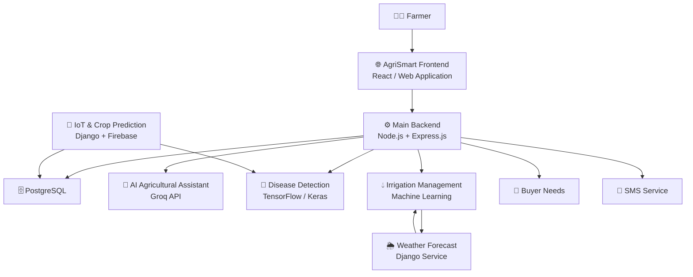
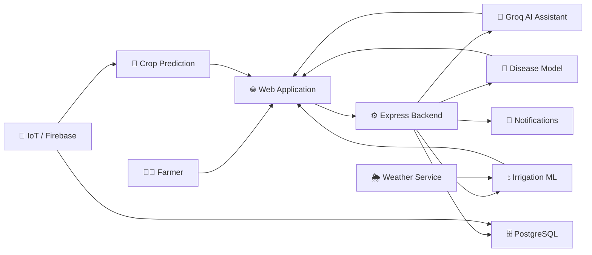
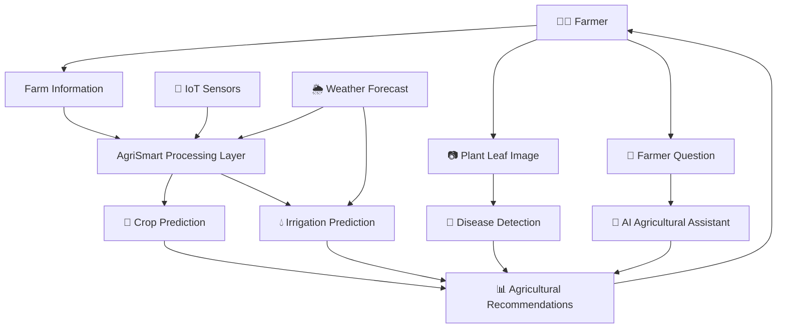

# 🌾 AgriSmart

### Intelligent Agriculture Platform for Smarter Farming


---

## 📌 Overview

**AgriSmart** is an integrated **Smart Agriculture Platform** designed to help farmers make better, data-driven decisions using **Artificial Intelligence, Machine Learning, IoT, weather forecasting, irrigation management, and digital agricultural services**.

The platform brings multiple agricultural technologies together into a single ecosystem instead of requiring farmers to use separate applications for different farming activities.

AgriSmart provides capabilities including:

- 🤖 AI-powered agricultural assistance
- 🗣️ Local-language farming chatbot
- 🌿 Plant disease detection
- 🌱 Organic treatment recommendations
- 🌦️ Weather forecasting
- 💧 Smart irrigation management
- 📡 IoT-based agricultural monitoring
- 🌾 ML-based crop prediction
- 🛒 Farmer–buyer needs management
- 📱 SMS notifications
- 🔐 Secure farmer authentication

---

# 🎯 Project Vision

The primary goal of AgriSmart is to create a unified digital platform where agricultural data, AI models, IoT devices, weather information, and farmer services work together.

```text
                         AGRISMART
                            │
        ┌───────────────────┼───────────────────┐
        │                   │                   │
        ▼                   ▼                   ▼
       AI                  IoT             Agricultural
   Intelligence          Monitoring          Services
        │                   │                   │
        ├───────────┬───────┘                   │
        │           │                           │
        ▼           ▼                           ▼
   Disease       Crop Prediction          Farmer Support
   Detection
        │
        ▼
Organic Treatment
        │
        └──────────────────┐
                           ▼
                    Smarter Farming
                           │
                           ▼
                        FARMER
```

---

# ✨ Core Features

## 🤖 AI Agricultural Assistant

AgriSmart includes an AI-powered farming chatbot that uses the **Groq API** to answer agriculture-related questions.

The assistant is designed to support farmers in **local and regional languages**, making AI-based agricultural information more accessible.

### Capabilities

- 🌾 Farming-related question answering
- 🌱 Crop and cultivation guidance
- 💧 Irrigation-related questions
- 🌿 General agricultural recommendations
- 🌦️ Weather-related farming queries
- 🗣️ Local-language interaction
- 🤖 AI-generated agricultural assistance

```text
Farmer
   │
   │ Question in Local Language
   ▼
AgriSmart Chatbot
   │
   ▼
Groq API
   │
   ▼
AI Response
   │
   ▼
Local-Language Answer
```

The Groq API key is configured through environment variables and should never be committed to the repository.

---

# 🌿 Plant Disease Detection

AgriSmart uses a **TensorFlow/Keras-based deep learning model** to identify potential plant diseases from leaf images.

After detecting a disease, the platform can provide **organic treatment and prevention recommendations**.

```text
Plant Leaf Image
       │
       ▼
Image Processing
       │
       ▼
Deep Learning Model
       │
       ▼
Disease Classification
       │
       ▼
Disease Identification
       │
       ▼
Organic Treatment
       │
       ▼
Prevention Guidance
```

### Key Capabilities

- 📷 Leaf image analysis
- 🧠 Deep learning classification
- 🦠 Plant disease identification
- 🌱 Organic treatment recommendations
- 🛡️ Prevention guidance

The trained disease model is maintained separately from the main application and exposed through the ML service architecture.

---

# 🌦️ Weather Forecasting

AgriSmart includes a dedicated **Django-based weather forecasting service**.

Weather information can be retrieved using geographic coordinates such as:

```text
Latitude + Longitude
        │
        ▼
Weather Service
        │
        ▼
Weather Provider API
        │
        ▼
Weather Information
```

The weather feature provides information such as:

- 🌡️ Temperature
- 💧 Humidity
- 🌧️ Rain probability
- 📅 Short-term forecast
- 🌍 Location-based weather information

The weather service is particularly important for agricultural decision-making and is connected with the platform's **irrigation management feature**.

---

# 💧 Irrigation Management

AgriSmart includes an ML-based irrigation management module that works together with the platform's **weather forecasting feature**.

Instead of making irrigation decisions independently, the irrigation system can use weather information as part of its agricultural decision-making process.

```text
Crop / Farm Data
       +
Weather Forecast
       │
       ▼
Feature Processing
       │
       ▼
Irrigation ML Model
       │
       ▼
Irrigation Prediction
       │
       ▼
Farmer Recommendation
```

### Benefits

- 💧 Better water management
- 🌦️ Weather-aware irrigation decisions
- 🌱 Crop-focused recommendations
- 📊 Data-driven irrigation management
- ♻️ Reduced unnecessary water usage

---

# 📡 IoT & Crop Prediction

The IoT module connects agricultural data with Machine Learning functionality.

Firebase is used for IoT-related data integration, while the Django module handles data processing and crop prediction.

```text
IoT Sensors
     │
     ▼
 Firebase
     │
     ▼
 Django Backend
     │
     ▼
Data Processing
     │
     ▼
Feature Scaling
     │
     ▼
ML Crop Model
     │
     ▼
Crop Prediction
```

### Features

- 📡 IoT data integration
- 🔥 Firebase integration
- 🌾 Crop prediction
- 📊 Agricultural data processing
- 🤖 Machine Learning model integration
- 🌱 Crop recommendations

---

# 🛒 Farmer–Buyer Platform

AgriSmart also provides functionality for managing **buyer needs and agricultural demand**.

This allows agricultural requirements to become part of the wider platform instead of keeping crop production and market needs separate.

```text
Farmer
  │
  ▼
AgriSmart
  │
  ▼
Agricultural Information
  │
  ▼
Buyer Needs
  │
  ▼
Farmer–Buyer Connection
```

---

# 📱 Notifications

AgriSmart contains an SMS service for sending important agricultural notifications.

Possible notification use cases include:

- 💧 Irrigation alerts
- 🌦️ Weather-related notifications
- 🌱 Agricultural updates
- 📢 Important farmer alerts
- 📱 System notifications

Sensitive SMS credentials are managed through environment variables.

---

# 🏗️ System Architecture

AgriSmart follows a **modular architecture** where the main web application communicates with specialized backend, AI, ML, IoT, and weather services.



---

# 🔄 Complete AgriSmart Data Flow



---

# 🧩 Technology Architecture

AgriSmart combines multiple technologies because different parts of the platform have different technical requirements.

```text
                         AgriSmart
                            │
             ┌──────────────┼──────────────┐
             │              │              │
             ▼              ▼              ▼
          Frontend       Backend       AI / ML Layer
             │              │              │
          React         Node.js        TensorFlow
             │          Express.js      Scikit-learn
             │              │           FastAPI
             │              │           Groq API
             │              │
             └──────────────┼──────────────┘
                            │
                ┌───────────┼───────────┐
                │           │           │
                ▼           ▼           ▼
            PostgreSQL   Firebase    Django
                │           │           │
                ▼           ▼           ▼
             Core Data    IoT Data   Weather Service
```

---

# 🛠️ Technology Stack

## Frontend

| Technology | Purpose |
|---|---|
| React | Frontend application |
| JavaScript | Application logic |
| HTML5 | Application structure |
| CSS | Styling and responsive UI |
| PostCSS | CSS processing |

## Main Backend

| Technology | Purpose |
|---|---|
| Node.js | Backend runtime |
| Express.js | REST API framework |
| PostgreSQL | Main relational database |
| JWT | Authentication |
| bcrypt | Password hashing |
| dotenv | Environment configuration |
| CORS | Frontend-backend communication |

## AI & Machine Learning

| Technology | Purpose |
|---|---|
| Groq API | Agricultural chatbot |
| Python | ML development |
| TensorFlow | Deep learning |
| Keras | Disease classification |
| Scikit-learn | Machine Learning |
| NumPy | Numerical processing |
| Pandas | Data processing |
| Joblib | Model serialization |

## Supporting Services

| Technology | Purpose |
|---|---|
| Django | Weather and IoT-related services |
| FastAPI | ML API services |
| Firebase | IoT data integration |
| PostgreSQL | Persistent application data |
| SMS Service | Farmer notifications |

---

# 📁 Project Structure

```text
AGRISMART/
│
├── backend/                    # Main Node.js / Express backend
│   ├── middleware/
│   ├── routes/
│   ├── services/
│   ├── database.js
│   ├── database-schema.sql
│   ├── server.js
│   └── README.md
│
├── Chatbot/                    # AI farming chatbot
│   └── Groq-powered
│
├── disease_model/              # Plant disease ML model
│   ├── training notebooks
│   ├── trained model
│   └── disease resources
│
├── IOT/                        # IoT + crop prediction module
│   ├── crop_project/
│   ├── ml_model/
│   ├── prediction/
│   ├── templates/
│   ├── static/
│   └── Firebase configuration
│
├── Irrigation_ml/              # Irrigation prediction module
│   ├── dataset
│   ├── training script
│   ├── prediction script
│   ├── irrigation model
│   └── API
│
├── ml-api/                     # FastAPI ML services
│   ├── main.py
│   ├── irrigation_server.py
│   └── requirements.txt
│
├── public/                     # Public frontend assets
│
├── src/                        # Main frontend source
│
├── supabase/                   # Supabase-related project configuration
│
├── weather/                    # Django weather forecasting service
│   ├── forecast/
│   ├── weather_project/
│   ├── manage.py
│   └── requirements.txt
│
├── .env                        # Local environment variables
├── .env.development            # Development configuration
├── .env.example                # Environment variable template
├── .gitignore
├── components.json
├── eslint.config.js
├── fix-rls-policies.sql
├── index.html
├── package.json
├── package-lock.json
├── postcss.config.js
└── QUICK-START.md
```

---

# 📂 Module Responsibilities

### `backend/`

The primary backend of AgriSmart.

Responsible for:

- Authentication
- PostgreSQL integration
- Agricultural assistant routes
- Irrigation routes
- Buyer needs
- SMS services
- Protected APIs
- Business logic

---

### `Chatbot/`

Contains the conversational AI functionality for farming-related questions.

The chatbot uses the **Groq API** and is designed to communicate with farmers in local languages.

---

### `disease_model/`

Contains the plant disease detection Machine Learning components.

It uses deep learning to analyze plant leaf images and identify potential diseases.

---

### `IOT/`

Provides IoT and crop prediction functionality.

It combines:

```text
IoT Data
+
Firebase
+
Django
+
Machine Learning
```

to generate crop-related insights.

---

### `Irrigation_ml/`

Contains the irrigation prediction Machine Learning implementation.

The irrigation feature is connected with the platform's **weather forecasting capability** to support weather-aware irrigation decisions.

---

### `ml-api/`

Contains FastAPI-based ML services that expose Machine Learning functionality to other parts of the AgriSmart platform.

It includes services for:

- 🌿 Disease detection
- 💧 Irrigation management

---

### `weather/`

Contains the Django weather forecasting service.

It provides location-based weather information using latitude and longitude and supports agricultural features such as irrigation management.

---

### `src/`

Contains the main frontend application and user interface.

---

### `public/`

Contains static public assets used by the frontend.

---

# 🔐 Authentication & Security

The main backend uses **JWT-based authentication** for protected application routes.

Passwords are hashed using **bcrypt** before being stored.

Authentication flow:

```text
User
 │
 ▼
Signup / Signin
 │
 ▼
Express Backend
 │
 ▼
Password Verification
 │
 ▼
JWT Token
 │
 ▼
Authenticated Requests
 │
 ▼
Protected API Routes
```

### Security Practices

- 🔐 JWT authentication
- 🔑 Password hashing
- 🌐 CORS configuration
- 🛡️ Protected routes
- 🔒 Environment-based secrets
- 🗄️ Database access control
- 🚫 Sensitive credentials excluded from Git

---

# ⚙️ Environment Configuration

AgriSmart uses environment variables for sensitive and environment-specific configuration.

Example:

```env
# Backend
PORT=3001

# Database
DB_HOST=localhost
DB_PORT=5432
DB_USER=postgres
DB_PASSWORD=your_password
DB_NAME=smart_farm

# Authentication
JWT_SECRET=your_secret_key
JWT_EXPIRES_IN=7d

# Frontend
FRONTEND_URL=http://localhost:8080

# AI Assistant
GROQ_API_KEY=your_groq_api_key

# Weather
OPENWEATHER_API_KEY=your_api_key
```

> The exact variables depend on the individual service configuration.

> **Never commit `.env` or private API keys to GitHub.** Use `.env.example` to document required variables without exposing credentials.

---

# 🚀 Getting Started

## Prerequisites

Make sure the following are installed:

- Node.js
- npm
- Python 3.x
- PostgreSQL
- Git

Depending on the feature being developed, additional Python dependencies may be required.

---

## 1. Clone the Repository

```bash
git clone <repository-url>
cd AGRISMART
```

---

## 2. Install Frontend / Main Dependencies

```bash
npm install
```

---

## 3. Configure Environment Variables

Create your local environment configuration from the provided example:

```text
.env.example
```

Then configure the required API keys, database credentials, and service settings.

---

## 4. Start the Main Application

Use the project's configured npm command:

```bash
npm run dev
```

The frontend will start using the development configuration.

---

## 5. Start Required Services

Depending on the feature being tested, start the required backend or Python service separately.

### Main Backend

```bash
cd backend
npm install
npm start
```

### Weather Service

```bash
cd weather
python -m venv .venv
```

Activate the environment and install:

```bash
pip install -r requirements.txt
```

Then:

```bash
python manage.py migrate
python manage.py runserver 0.0.0.0:8001
```

### ML APIs

```bash
cd ml-api
pip install -r requirements.txt
```

Disease detection:

```bash
uvicorn main:app --reload
```

Irrigation:

```bash
uvicorn irrigation_server:app --reload
```

> Individual services may run on different ports according to their configuration.

---

# 🔗 Service Communication

AgriSmart follows a modular service architecture.

```text
                         ┌─────────────────┐
                         │    Frontend     │
                         │     React       │
                         └────────┬────────┘
                                  │
                                  ▼
                         ┌─────────────────┐
                         │  Main Backend   │
                         │ Node + Express  │
                         └────────┬────────┘
                                  │
              ┌───────────────────┼───────────────────┐
              │                   │                   │
              ▼                   ▼                   ▼
        PostgreSQL          AI Assistant          ML APIs
                              Groq API          FastAPI Services
                                                      │
                                           ┌──────────┴──────────┐
                                           │                     │
                                           ▼                     ▼
                                      Disease ML          Irrigation ML
                                                                  │
                                                                  ▼
                                                           Weather Service
```

This modular design allows individual agricultural capabilities to be developed, tested, and improved independently while remaining part of the same AgriSmart ecosystem.

---

# 🧪 Testing

Different components contain their own testing and validation mechanisms.

The main backend includes end-to-end API testing.

Recommended testing tools include:

- Postman
- Thunder Client
- cURL
- Django tests
- Python ML testing
- Browser-based frontend testing

Example backend health check:

```bash
curl http://localhost:3001/health
```

FastAPI documentation:

```text
/docs
```

---

# 🔄 Development Workflow

```text
                    Developer
                        │
                        ▼
                 AgriSmart Source
                        │
          ┌─────────────┼─────────────┐
          │             │             │
          ▼             ▼             ▼
       Frontend       Backend       ML Services
          │             │             │
          │             ▼             ▼
          │         PostgreSQL    Models / APIs
          │
          └─────────────┬─────────────┘
                        │
                        ▼
                  Integration
                        │
                        ▼
                    Testing
                        │
                        ▼
                    Deployment
```

---

# 🌱 Smart Agriculture Workflow

AgriSmart combines information from multiple agricultural sources.



---

# 🌾 Why AgriSmart?

Traditional agricultural applications often focus on a single problem.

AgriSmart takes a broader approach by connecting multiple technologies:

```text
             ┌───────────────────────┐
             │       AgriSmart       │
             └───────────┬───────────┘
                         │
       ┌─────────────────┼─────────────────┐
       │                 │                 │
       ▼                 ▼                 ▼
      AI                IoT             Weather
       │                 │                 │
       ▼                 ▼                 ▼
 Disease Detection   Crop Data       Forecasting
       │                 │                 │
       ▼                 ▼                 ▼
 Organic Treatment  Crop Prediction   Irrigation
       │                 │                 │
       └─────────────────┼─────────────────┘
                         │
                         ▼
                  Farmer Assistance
                         │
                         ▼
                  Better Decisions
```

The platform is designed to transform agricultural data into practical information that farmers can understand and use.

---

# 🔒 Git & Security

The following should not be committed to the repository:

```text
.env
.env.local
.env.production
.venv/
venv/
node_modules/
__pycache__/
*.pyc
```

Private API keys and credentials should never be stored directly in source code.

Important credentials include:

- Groq API key
- Weather API key
- Database passwords
- Firebase service credentials
- JWT secrets
- SMS provider credentials

---

# 🚀 Future Roadmap

Potential future improvements include:

- 📱 Dedicated mobile application
- 🗣️ More regional language support
- 🤖 More advanced agricultural AI
- 🌾 Improved crop prediction
- 🦠 Disease severity detection
- 💧 Automated irrigation control
- 📡 Real-time IoT monitoring
- 🌦️ Weather-aware disease prediction
- 📊 Farmer analytics dashboard
- 🔔 Advanced notification system
- 🛒 Expanded farmer–buyer marketplace
- 🗺️ Location-based agricultural recommendations
- 🎙️ Voice-based farming assistant
- ☁️ Cloud deployment
- 🐳 Docker-based deployment
- 🔄 CI/CD pipeline

---

# 📊 Platform Summary

| Module | Technology | Main Responsibility |
|---|---|---|
| 🌐 Frontend | React | User interface |
| ⚙️ Backend | Node.js + Express | Core APIs and business logic |
| 🔐 Authentication | JWT + bcrypt | Secure user authentication |
| 🗄️ Database | PostgreSQL | Application data |
| 🤖 Chatbot | Groq API | Local-language farming assistance |
| 🌿 Disease Detection | TensorFlow / Keras | Plant disease classification |
| 💧 Irrigation | Python + ML | Irrigation prediction |
| 🌦️ Weather | Django | Weather forecasting |
| 📡 IoT | Django + Firebase | Agricultural IoT data |
| 🌾 Crop Prediction | Scikit-learn | Crop recommendations |
| 📱 Notifications | SMS Service | Farmer alerts |
| 🛒 Buyer Needs | Node.js + Express | Agricultural demand management |

---

# 📌 Project Status

**🚧 Active Development**

AgriSmart is an evolving smart agriculture platform with multiple interconnected modules for AI assistance, crop monitoring, disease detection, irrigation management, weather forecasting, IoT integration, and agricultural services.

---

# 🌾 Conclusion

**AgriSmart** brings together **Artificial Intelligence, Machine Learning, IoT, weather forecasting, irrigation management, and digital agricultural services** into one unified platform.

The goal is simple:

```text
             DATA
              │
              ▼
        INTELLIGENCE
              │
              ▼
        RECOMMENDATIONS
              │
              ▼
       FARMER DECISIONS
              │
              ▼
       SMARTER FARMING 🌱
```

By connecting these technologies, AgriSmart aims to make modern agricultural tools more accessible, practical, and useful for farmers.

---

## 📄 License

This project is developed for educational, research, and smart agriculture purposes.

---

## 🌱 AgriSmart

**An integrated smart agriculture platform for intelligent farming, farmer assistance, and data-driven agricultural decisions.**